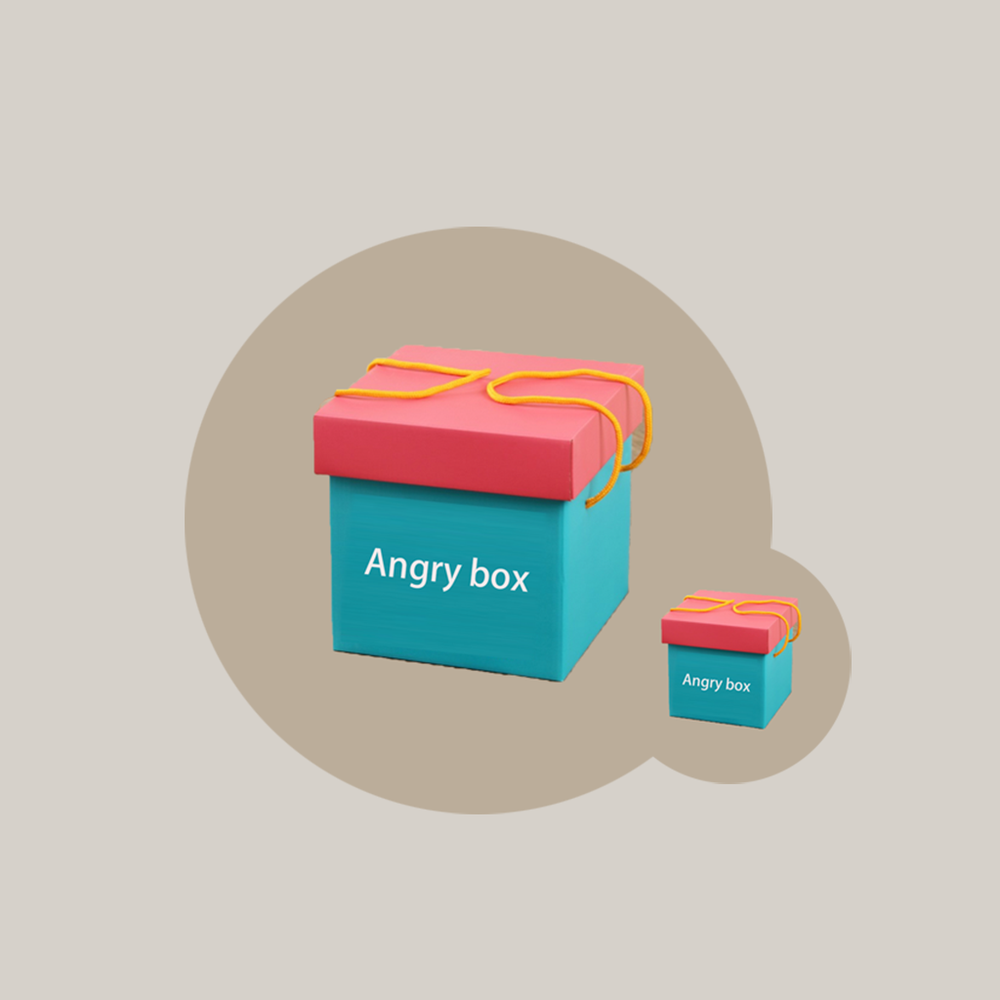

## Welcome to My Angry Box

When we feel angry and impulsive, we often do something that makes us regret or bad. We need to control our emotions and find the root causes and solutions. When we feel angry, we can record these problems and help ourselves analyze the causes, time and solutions of angry events. When you successfully solve an anger problem, you can remove it from your anger list.

If you have any questions, you can either leave a message or send the questions to our email address.

We will answer them for you in the first time.

### Address: zhanghesongyuan7@126.com

Thank you!
